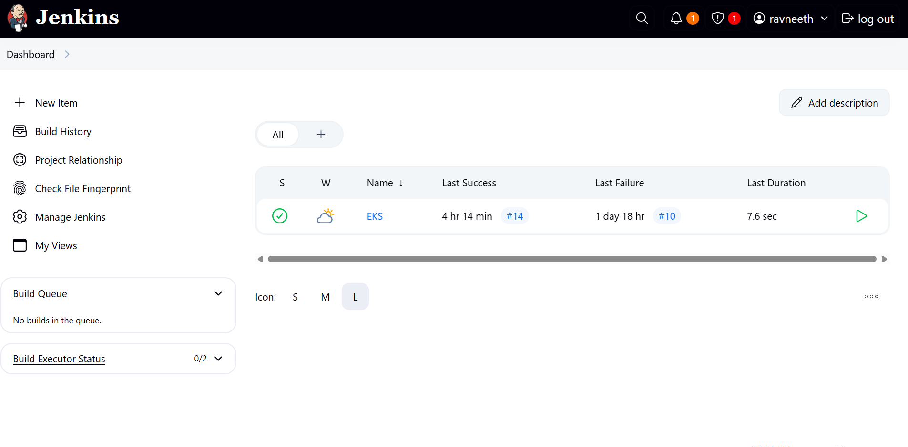
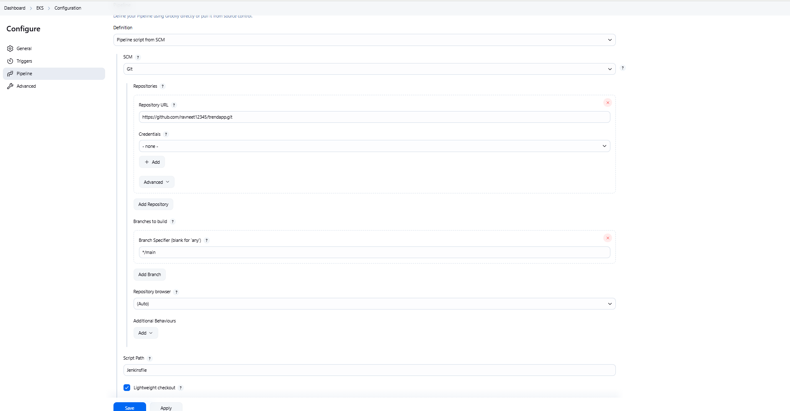
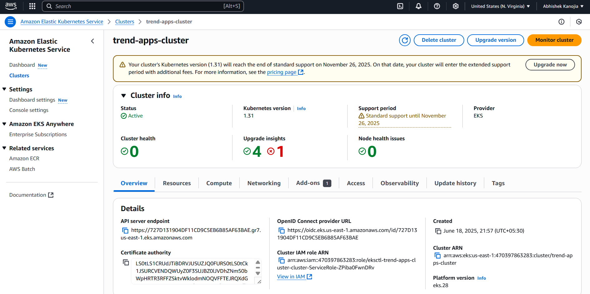

# 📦 Trend React App – Production Deployment
This project demonstrates a full-stack DevOps pipeline by deploying a React application using Docker, Terraform, AWS EKS (Kubernetes), and Jenkins CI/CD.
## 🚀 Tech Stack
- **Frontend**: React
- **Containerization**: Docker
- **Infrastructure**: Terraform (VPC, IAM, EC2)
- **CI/CD**: Jenkins + GitHub + DockerHub
- **Kubernetes**: AWS EKS with LoadBalancer
- **Monitoring**: Prometheus (optional)
## 📥 Clone the Repository
```bash
git clone https://github.com/ravneet12345/trendapp.git
cd trendapp
```
## 🐳 Docker Setup
### 🛠 Build Docker Image
```bash
docker build -t ravneeth123/trend-react-app:v1 .
```
### 📤 Push to DockerHub
```bash
docker login
docker push ravneeth123/trend-react-app:v1
```
## 🌐 Infrastructure with Terraform
### 🔧 Requirements
- Terraform
- AWS CLI configured
### 🏗 Steps
```bash
cd terraform
terraform init
terraform apply -auto-approve
```
Creates VPC, subnets, EC2 (for Jenkins), IAM roles, and EKS cluster.
## ☸️ EKS Setup with `eksctl`
```bash
eksctl create cluster \
  --name trend-apps-cluster \
  --region us-east-1 \
  --vpc-private-subnets=subnet-xxxx,subnet-yyyy \
  --nodegroup-name trend-node-group \
  --nodes 2
```
## 🧩 Kubernetes Deployment
```bash
aws eks --region us-east-1 update-kubeconfig --name trend-apps-cluster
kubectl apply -f k8s/deployment.yaml
kubectl apply -f k8s/service.yaml
```
## ⚙️ Jenkins CI/CD Pipeline
Requires:
- Docker & AWS CLI on Jenkins EC2
- DockerHub credentials in Jenkins (ID: `dockerhub-credentials`)
- Plugins: Docker Pipeline, Git, AWS CLI, Kubernetes CLI
### ✅ Jenkinsfile
```groovy
pipeline {
  agent any

  environment {
    IMAGE_NAME = "ravneeth123/trend-react-app"
    IMAGE_TAG = "latest"
    AWS_REGION = "us-east-1"
    EKS_CLUSTER = "trend-apps-cluster"
  }

  stages {
    stage('Docker Build') {
      steps {
        script {
          sh 'docker build -t ${IMAGE_NAME}:${IMAGE_TAG} .'
        }
      }
    }

    stage('Docker Login & Push') {
      steps {
        withCredentials([usernamePassword(
          credentialsId: 'dockerhub-credentials',
          usernameVariable: 'DOCKER_USER',
          passwordVariable: 'DOCKER_PASS'
        )]) {
          sh '''
            echo "$DOCKER_PASS" | docker login -u "$DOCKER_USER" --password-stdin
            docker push ${IMAGE_NAME}:${IMAGE_TAG}
          '''
        }
      }
    }

    stage('Configure Kubeconfig') {
      steps {
        sh "aws eks --region ${AWS_REGION} update-kubeconfig --name ${EKS_CLUSTER}"
      }
    }

    stage('Kubernetes Deploy') {
      steps {
        sh '''
          kubectl apply -f deployment.yaml
          kubectl apply -f services.yaml
        '''
      }
    }
  }

  post {
    success {
      echo '✅ Deployment complete!'
    }
    failure {
      echo '❌ Deployment failed!'
    }
  }
}

```
## 🔍 Monitoring (Optional)
```bash
helm repo add prometheus-community https://prometheus-community.github.io/helm-charts
helm install prometheus prometheus-community/prometheus
```
## 🌐 Access Application
```bash
kubectl get svc
```
Use the EXTERNAL-IP of the service to access the app.
## 📸 Screenshots
- Jenkins job setup
- DockerHub pushed image
- EKS pods/services
- App UI running
## 📬 Submission Checklist
- [x] GitHub: https://github.com/ravneet12345/trendapp
- [x] DockerHub: https://hub.docker.com/r/ravneeth123/trend-react-app
- [x] Jenkinsfile and Terraform included
- [x] LoadBalancer: http://aea0cdeeeb5c34d1baac34edf06ee5e5-607396639.us-east-1.elb.amazonaws.com/
## 📸 Screenshots

### ✅ Jenkins Pipeline



### 🐳 DockerHub Image


### ☸️ EKS Services & Pods


### 🌐 Application UI

### 🌐 Monitoring

